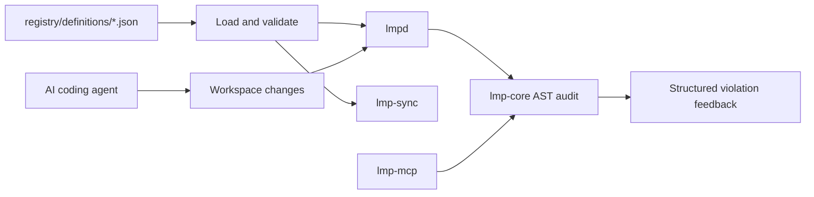

<div align="center"></div>

<p align="center">
  <a href="https://github.com/lendmind-protocol/LMP/actions">CI</a> ·
  <a href="./ARCHITECTURE.md">Architecture</a> ·
  <a href="./CONTRIBUTING.md">Contributing</a> ·
  <a href="./LICENSE">MIT License</a> ·
  <a href="./SECURITY.md">Security</a>
</p>

LMP sits between an AI coding agent and its workspace. It loads an engineering
profile, watches source changes, audits Rust syntax and code shape, and returns
actionable violations before architectural drift becomes a merge.

## Why LMP

AI agents are good at producing code and bad at preserving the invisible rules
that make a codebase coherent. LMP turns those rules into inspectable profile
data and repeatable checks.

## Quick start

### Build the Rust workspace

```bash
cargo build --workspace
```

### Run the daemon

Use a profile from the registry and point the daemon at a Rust workspace:

```bash
cargo run --bin lmpd -- \
  --mind-select tj-ponytail \
  --workspace ./crates
```

The daemon keeps running and audits modified or newly created `.rs` files.

### Sync a profile

```bash
cargo run --bin lmp-sync -- \
  --mind-id tj-ponytail \
  --output-dir ./.lmp_telemetry/minds
```

### Run the benchmark harness

```bash
python3 orchestrator/test_bed.py
python3 orchestrator/plot_metrics.py
```

## MCP integration

Build the adapter and register it with an MCP-compatible client as a stdio
server:

```bash
cargo build --release --bin lmp-mcp
```

The `enforce_architectural_axioms` tool accepts:

```json
{
  "workspace_path": "/path/to/workspace",
  "mind_alias": "tj-ponytail"
}
```

It audits Rust files recursively and returns the file count plus every detected
violation. The adapter uses the same `lmp-core` validator as `lmpd`.

## Profile lifecycle



Profiles are JSON documents. `lmp-core` supplies defaults for optional
telemetry fields so both full mind profiles and lightweight skill profiles can
be loaded safely. See [ARCHITECTURE.md](./ARCHITECTURE.md) for module details
and the [contribution guide](./CONTRIBUTING.md) for extension points.

## Development checks

```bash
cargo fmt --all -- --check
cargo check --workspace
cargo test --workspace
python3 -m compileall -q orchestrator
node --check packages/create-lmp/bin.js
```

## License

LMP is released under the [MIT License](./LICENSE).

See also: [Security Policy](./SECURITY.md) · [Code of Conduct](./CODE_OF_CONDUCT.md) · [Notices](./NOTICE.md)
